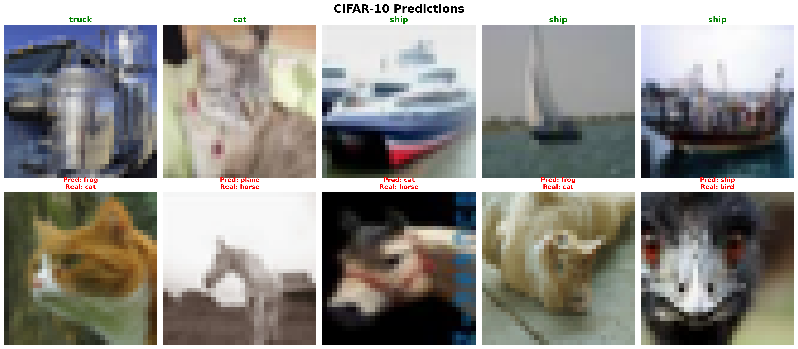

# 基于超分辨率特征增强的鲁棒图像分类多任务学习

**Winter of Code (WoC) - 多任务学习方向课题**


## 📖 项目简介

本项目是 WoC 寒假课题的验收代码，核心目标是探究**底层视觉任务（图像超分辨率重建）如何有效促进高层视觉任务（图像分类）**的表现。

在现实场景中，分类网络面对低分辨率、模糊的退化图像时，准确率会大幅下降。本项目提出了一种**串联级联式多任务学习架构**：先利用超分辨率网络（SRNet）将模糊低分辨率输入重建为清晰图像，再将重建结果喂给分类网络（ClassifyNet）进行识别。通过**联合损失函数**端到端微调，显著提升了模型在低画质条件下的分类鲁棒性。

---

## 📂 目录结构

```text
.
├── NetSet.py               # 网络架构定义 (Encoder, SRNet, ClassifyNet)
├── datasets.py             # 数据集加载 (DIV2KDataset, CIFAR10Dataset, Fuzz 退化)
├── Test.py                 # 评估工具 (PSNR / SSIM 计算)
├── task1.ipynb             # Task 1: 超分辨率网络 — 训练与测试
├── task2.ipynb             # Task 2: 图像分类网络 — 训练与测试
├── multi_learning.ipynb    # 多任务联合微调与对比评估
├── DS/                     # 数据集
│   ├── CIFAR10/            #   CIFAR-10 (分类, 10 类, 32×32)
│   ├── DIV2K/train/        #   DIV2K (超分辨率训练集, 高清自然图像)
│   └── Set14/              #   Set14 (超分辨率标准测试集, 14 张图)
└── results/                # 输出结果
    ├── task1/              #   SR 权重 + 训练对比图 + Set14 验证图
    ├── task2/              #   分类权重 + 预测可视化 (predictions.png)
    └── multi/              #   多任务联合微调权重
```

---

## 🛠️ 环境依赖

- Python >= 3.8
- PyTorch >= 2.0 + torchvision >= 0.15
- NumPy, Pillow, Matplotlib, Jupyter

### 安装

```bash
# 使用 conda（推荐）
conda create -n mtl python=3.10 -y
conda activate mtl
conda install pytorch torchvision pytorch-cuda=12.1 -c pytorch -c nvidia  # CUDA GPU
# 或 CPU: conda install pytorch torchvision cpuonly -c pytorch
pip install numpy pillow matplotlib jupyter
```

```bash
# 或使用 pip
pip install torch torchvision numpy pillow matplotlib jupyter
```


---

## 🧠 网络架构

### 模块概览

| 模块 | 核心结构 | 说明 |
| :--- | :--- | :--- |
| **Encoder** | Conv2d(3→64) + ReLU | 浅层特征提取，每个子网络各自实例化（参数独立） |
| **SRNet** | Encoder → Conv(64→128) → **8×ResBlock(128)** → Conv(128→64) → **PixelShuffle(2×)** → Sigmoid | 超分辨率重建，2× 放大，L1 Loss |
| **ClassifyNet** | Encoder → 5×Conv+MaxPool+Dropout → Flatten → 3×FC(2048→256→128→10) | CIFAR-10 十分类，CrossEntropy Loss |
| **MultiTaskNet** | SRNet → Normalize → ClassifyNet | 级联组合，联合 L1 + CE 损失微调 |

> 完整的层定义与参数详见 `NetSet.py`。

---

## 🤝 互促方式与训练策略

本项目采用 **预训练 → 级联组装 → 联合微调** 三阶段策略：

### Stage 1：独立预训练

| | Task 1 — 超分辨率 | Task 2 — 图像分类 |
| :--- | :--- | :--- |
| Notebook | `task1.ipynb` | `task2.ipynb` |
| 数据集 | DIV2K (RandomCrop 128, Bicubic 2× 降采样生成 LR-HR 对) | CIFAR-10 (50k 训练 / 10k 测试, Normalize) |
| 损失函数 | L1 Loss | CrossEntropyLoss |
| 优化器 | **Adam** (lr=1e-3) | **SGD** (lr=1e-3, momentum=0.9) |
| 学习率调度 | StepLR (step=25, γ=0.7) | — |
| Epochs | 100 | 100 |
| Batch Size | 64 | 64 |
| 权重输出 | `results/task1/model_epoch_100.pth` | `results/task2/model_epoch_100.pth` |

### Stage 2：级联组装

将两个预训练权重分别加载到 `MultiTaskNet.sr` 和 `MultiTaskNet.classifier`。

### Stage 3：端到端联合微调

在 CIFAR-10 上进行联合训练，退化流程：

```
干净图 (32×32) → denormalize → Fuzz(Bicubic 缩小至 16×16) → MultiTaskNet 输入
```

> `Fuzz` 类**只做 Bicubic 缩小**（32→16），不做放大。放大由 SRNet 内部的 PixelShuffle 完成。

联合损失函数：

$$\mathcal{L}_{total} = \lambda_{SR} \cdot \mathcal{L}_{L1}(X_{restored},\ X_{clean}) + \lambda_{CLS} \cdot \mathcal{L}_{CE}(Y_{pred},\ Y_{true})$$

| 超参数 | 值 |
| :--- | :--- |
| λ_SR / λ_CLS | 1.0 / 1.0 |
| 优化器 | SGD (lr=5e-4, momentum=0.9) |
| Epochs | 50 |
| Batch Size | 64 |

**核心思想**：为了降低总 Loss，SR 模块被迫将图像修复到"足够让分类器看清"的程度，从而直接拔高分类准确率。同时梯度回传到 SRNet，使其学会提取对分类最有价值的特征。

---

## 🚀 快速开始

### 1. 准备数据集

仓库已包含 CIFAR-10 和 Set14，**只需手动下载 DIV2K 训练集**：

| 数据集 | 状态 | 说明 |
| :--- | :--- | :--- |
| CIFAR-10 | ✅ 已包含 | `DS/CIFAR10/`，无需操作 |
| Set14 | ✅ 已包含 | `DS/Set14/`，无需操作 |
| DIV2K | ❌ 需下载 | 文件较大（~3.3GB），未包含在仓库中 |

**DIV2K 下载方式**：

```bash
# 下载 DIV2K 训练集 (800 张 HR 图片)
# 官方地址：https://data.vision.ee.ethz.ch/cvl/DIV2K/
wget https://data.vision.ee.ethz.ch/cvl/DIV2K/DIV2K_train_HR.zip

# 解压到项目目录
unzip DIV2K_train_HR.zip -d DS/DIV2K/
mv DS/DIV2K/DIV2K_train_HR/* DS/DIV2K/train/
```

> 也可以从 [DIV2K 官网](https://data.vision.ee.ethz.ch/cvl/DIV2K/) 手动下载 `DIV2K_train_HR.zip`，解压后将所有图片放入 `DS/DIV2K/train/` 目录。

### 2. 按顺序运行 Notebook

```bash
# Step 1: 超分辨率预训练
jupyter notebook task1.ipynb

# Step 2: 图像分类预训练
jupyter notebook task2.ipynb

# Step 3: 多任务联合微调 + 对比评估
jupyter notebook multi_learning.ipynb
```

每个 Notebook 从头到尾依次运行所有 Cell 即可。`multi_learning.ipynb` 会自动加载前两步的预训练权重。

---

## 📊 实验结果

### Task 1：超分辨率 (Set14 测试集)

| 评估指标 | 分数 |
| :--- | :--- |
| 平均 PSNR | **28.80** dB |
| 平均 SSIM | **0.8691** |

<!-- 取消注释并替换为实际路径：

*左：Bicubic 插值放大 | 中：SRNet 重建 | 右：Ground Truth*
-->

### Task 2 & Multi-Task：分类鲁棒性对比 (CIFAR-10 测试集)

| 测试场景 | 输入状态 | 模型 | Top-1 准确率 |
| :--- | :--- | :--- | :--- |
| 理想上限 | 清晰原图 (32×32) | Baseline ClassifyNet | **84.80**% |
| 退化基线 | 模糊插值图 (16→32, Bicubic) | Baseline ClassifyNet | **47.26**% |
| **本方案** | **模糊图 (16×16)** | **MultiTaskNet (联合微调)** | **80.95**% |

> 🏆 **准确率提升**：**+33.69%**（本方案 vs 退化基线），验证了底层视觉特征重建对高层语义任务的显著促进作用。

<!-- 取消注释：

-->

---

## 📝 总结

本项目从零实现了一个多任务学习系统，验证了**底层视觉任务（超分辨率）对高层语义任务（分类）的促进作用**。主要收获：

1. 掌握了 `Conv2d`、`PixelShuffle`、残差连接等 CNN 核心算子
2. 学会了自定义 `Dataset` / `DataLoader` 的数据管线搭建
3. 实践了**预训练 → 权重迁移 → 端到端联合微调**的多任务训练范式
4. 在调试维度不匹配 (Shape Mismatch) 中深刻理解了数据流尺寸推演的重要性
