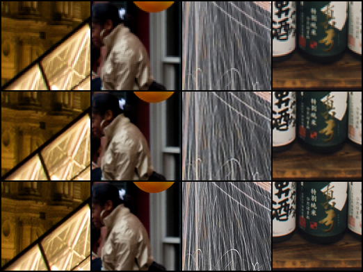

# 基于超分辨率特征增强的鲁棒图像分类多任务学习
**Winter of Code (WoC) - 深度学习/机器视觉方向课题**


## 📖 项目简介 (Project Overview)

本项目是寒假 WoC 课题的学术向验收代码。核心目标是探究 **底层视觉任务（图像超分辨率重建，Task 1）** 如何有效促进 **高层视觉任务（图像分类，Task 2）** 的表现。

在现实场景中，分类网络在面对低分辨率、模糊的退化图像时，准确率往往会发生断崖式下跌。本项目提出了一种**串联式多任务学习架构**：
先利用超分辨率网络（SRNet）对模糊输入进行特征修复与重建，再将重建后的高质量特征喂给分类网络（ClassifyNet）。通过**联合损失函数（Joint Loss）**端到端微调，极大提升了模型在低画质条件下的分类鲁棒性。

---

## 📂 目录结构 (Repository Structure)

```text
.
├── DS/                     # 数据集存放目录
│   ├── CIFAR10/            # CIFAR-10 分类数据集
│   ├── DIV2K/              # DIV2K 超分训练数据集
│   └── Set14/              # Set14 超分标准测试集
├── results/                # 训练权重与可视化结果保存目录
│   ├── task1/              # Task 1 (SR) 权重与对比图
│   ├── task2/              # Task 2 (CLS) 权重与混淆矩阵/预测图
│   └── multi/              # 多任务联合微调权重
├── NetSet.py               # 核心网络架构定义 (Encoder, SRNet, ClassifyNet)
├── datasets.py             # 数据集加载器 (DIV2K, CIFAR10, 模糊退化类 Fuzz)
├── Test.py                 # 评估工具类 (包含 PSNR 和 SSIM 的标准计算实现)
├── task1.ipynb             # Task 1: 图像超分辨率网络训练与测试
├── task2.ipynb             # Task 2: 图像分类网络训练与测试
└── multi_learning.ipynb    # 多任务阶段: 串联级联与联合微调训练
🛠️ 环境依赖 (Dependencies)
本项目基于 Python 3.10+ 构建，建议使用 GPU (CUDA/MPS) 进行训练以大幅缩短运行时间。
torch >= 2.0.0
torchvision
numpy
Pillow (PIL)
matplotlib
🧠 网络架构 (Network Architecture)
本项目将网络解耦为三个核心模块，并在多任务阶段进行级联：
Shared Encoder (共享特征提取器):
结构：Conv2d(3 -> 64, 3x3) + ReLU
作用：作为视觉系统的“眼睛”，从原始/模糊图像中提取浅层纹理和边缘特征。
Task 1: SRNet (超分辨率网络):
结构：基于 Encoder，串联 8 个 Residual Blocks (残差块) 进行深层特征映射，最后通过 PixelShuffle (亚像素卷积) 实现 
2
×
2×
 图像放大。
Task 2: ClassifyNet (分类网络):
结构：基于 Encoder，串联多层卷积池化，最后通过全连接层输出 10 个类别的 logits。
MultiTaskNet (多任务级联模型):
数据流向：Blurry Input (16x16) 
→
→
 SRNet 
→
→
 Restored Image (32x32) 
→
→
 Normalize 
→
→
 ClassifyNet 
→
→
 Label。
🤝 互促方式与训练策略 (Mutual Promotion Mechanism)
为了实现“Task 1 促进 Task 2”，本项目采用了 预训练 + 联合微调 (Pre-train & Joint Fine-tuning) 的策略：
独立预训练：
在 DIV2K 数据集上独立训练 SRNet，使其 Encoder 习得将模糊特征重建为清晰特征的能力。
在 CIFAR-10 数据集上独立训练 ClassifyNet，获取分类头的初始化权重。
端到端联合微调 (Joint Fine-tuning)：
将预训练权重加载至 MultiTaskNet。
对 CIFAR-10 数据人工施加退化（缩小再放大，模拟马赛克模糊）。
使用联合损失函数进行反向传播：
L
t
o
t
a
l
=
λ
S
R
⋅
L
L
1
(
X
r
e
s
t
o
r
e
d
,
X
c
l
e
a
n
)
+
λ
C
L
S
⋅
L
C
E
(
Y
p
r
e
d
,
Y
t
r
u
e
)
L 
total
​
 =λ 
SR
​
 ⋅L 
L1
​
 (X 
restored
​
 ,X 
clean
​
 )+λ 
CLS
​
 ⋅L 
CE
​
 (Y 
pred
​
 ,Y 
true
​
 )
效果：为了降低总 Loss，SR 模块被迫将图像修复到“足够让分类器看清”的程度，从而直接拔高了分类准确率。
🚀 快速开始 (Quick Start)
请按照以下顺序依次运行 Jupyter Notebook 脚本：
运行 Task 1 (超分预训练)
打开并运行 task1.ipynb。
模型将在 DIV2K 上训练，并在验证时输出重建对比图，最终将权重保存至 results/task1/。
运行 Task 2 (分类预训练)
打开并运行 task2.ipynb。
模型将在干净的 CIFAR-10 上训练，生成分类器的基础权重，保存在 results/task2/。
运行多任务互促 (联合微调与验证)
打开并运行 multi_learning.ipynb。
代码将自动加载前两步的权重，并在构造的模糊 CIFAR-10 数据上进行多任务微调。
Notebook 最后会自动输出Baseline vs 多任务模型的核心对比数据。
📊 任务指标与可视化结果 (Results & Metrics)
Task 1: 图像超分辨率 (Super-Resolution)
在 Set14 标准测试集上的评估结果如下：
评估指标	分数 (Score)
平均 PSNR	[填写你的实际数值, 如 28.50] dB
平均 SSIM	[填写你的实际数值, 如 0.8250]
(选填：可在此处插入一张 results 文件夹下的 SR 修复对比图)
<!--  -->
Task 2 & Multi-Task: 分类鲁棒性对比 (Classification Robustness)
在 CIFAR-10 测试集上的
